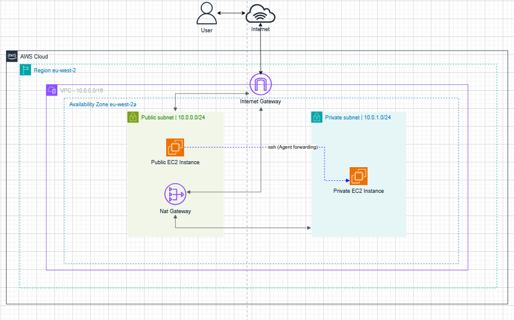
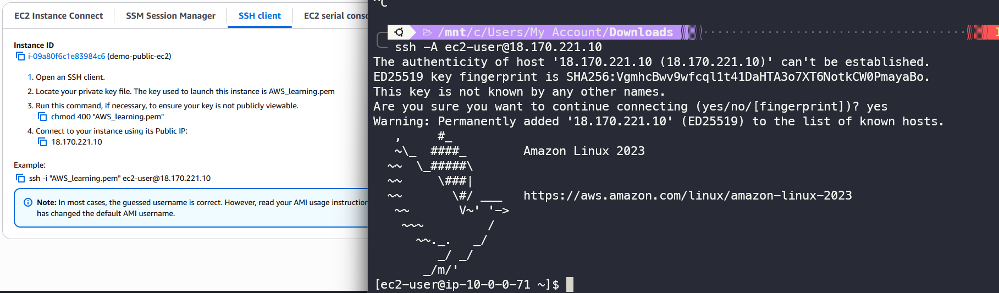
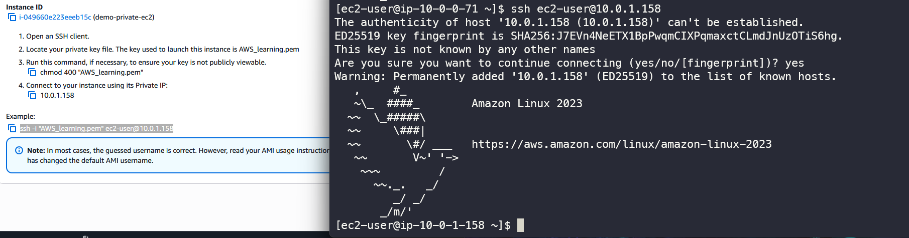
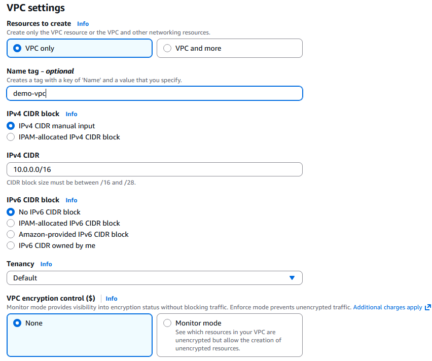
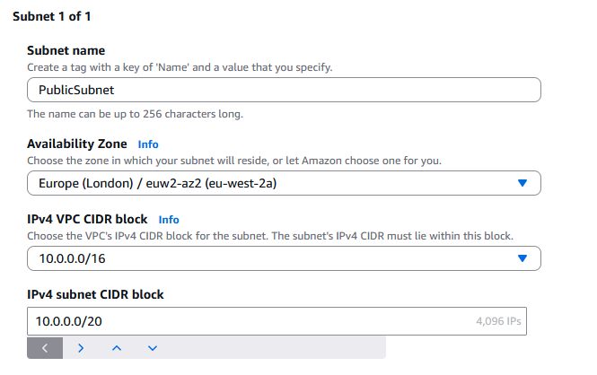
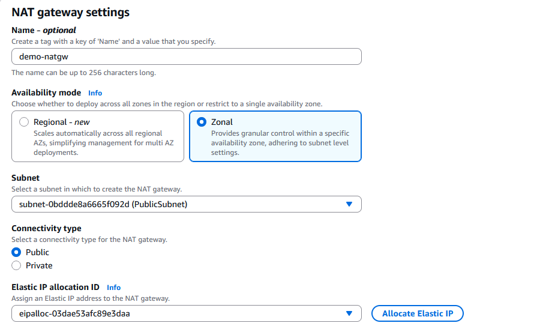
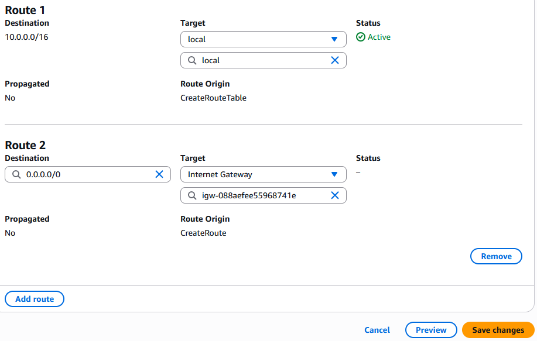
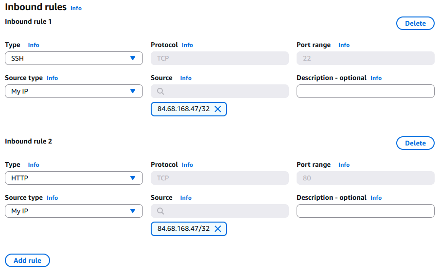
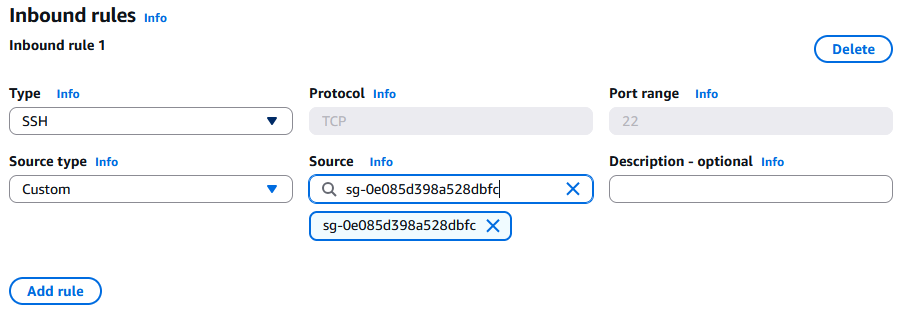
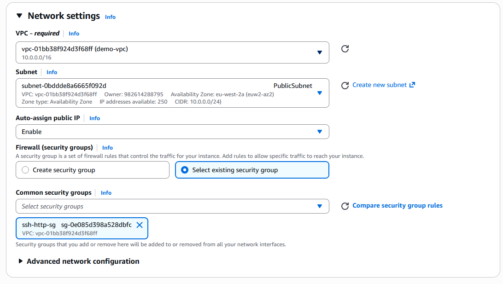

# Assignment 1: VPC & Networking

This assignment is about building a full custom network from scratch, in order to grasp the fundamentals of cloud networking, routing and segmentation.

## Objective

Create a custom VPC with one public subnet and one private subnet, set up the correct routing for internet access, and deploy EC2 instances across them.

## Architecture Diagram



## Deployment Proof

**Connecting to Public EC2**




**Connecting to Private EC2**



---

## Solution

### 1. Create the VPC

**1.1 Configuring VPC**

Once logged into the AWS console, navigate to the VPC service and Click the **Create VPC** button which will allow us to configure the settings for our custom VPC.

The screenshot below are the settings:



- `VPC only` is selected so that it doesn't create other resources such as subnets and Internet gateways, etc. (creating those manually is the point of this assignment).
- Named the VPC 'demo-vpc' (optional, this helps with organisation and clarity).
- `IPv4 CIDR manual input` allows us to enter a custom CIDR.
- `10.0.0.0/16` is the IPv4 CIDR of our VPC which gives us 65536 IPs to work with.
- `No IPv6 CIDR block` we are not working with IPv6 IPs in this assignment.
- Tenancy is set to `Default`, meaning instances share physical hosts with other customers. The `Dedicated` option would mean your own physical host but this increases cost dramatically.
- VPC encryption control is a relatively new feature that encrypts all traffic that transits through our VPC, I selected `None` as this is not required for this assignment.

**1.2 Creating Public and Private Subnets**

The VPC has been created, navigate to the Subnet tab in the console and click **Create subnet**. Select the VPC we just created for the `VPC ID` to assign the new subnets to it.

Public Subnet settings:



`PublicSubnet` is created in the `eu-west-2a` AZ. If creating multiple public and private subnets, placing them across different AZs would achieve high availability. 

TThe CIDR of `10.0.0.0/24` fits within the VPC's `10.0.0.0/16` block, giving us 256 IP range which is sufficient given the small number of expected resources.

Once `PublicSubnet` is made, we can click the **Add Subnet** button to make our `PrivateSubnet`. The CIDR blocks must not overlap, so `PrivateSubnet` is assigned `10.0.1.0/24`.

**1.3 Enable auto assign IPv4 Address**

EC2 instances in the public subnet need a public IPv4 address to connect to the internet. In the Subnets dashboard, select `PublicSubnet`, click **Actions**, then **Edit subnet settings**, and toggle **Enable auto-assign public IPv4 address**

This is not needed for the private subnet as resources in it will connect to the internet via a NAT Gateway which will have it's own Elastic IP address.

---

### 2. Internet Access

**2.1 Internet Gateway**

This step is necessary for our EC2 instances to connect to the internet. Navigate to the **Internet gateways** tab, and create the Internet Gateway, then attach it to our custom VPC.


**2.2 NAT GateWay**

NAT Gateway is needed for the instance in the private subnet to connect to the internet. 



- `Zonal` availability mode is appropriate here as we only have one public subnet. `Regional` mode would automatically scale across different public subnets in different AZs.
- Connectivity type is `Public`, which is required for access to the internet, `Private` option would restrict traffic to within the VPC only.
- Since `Public` is selected, the NAT Gateway requires an Elastic IP, Click the **Allocate Elastic IP** and AWS will provision and attach one automatically,

---

### 3. Route Tables

**3.1 Public Route Table**

The route table is what makes a subnet public or private. For the public route table, we need two routes:
- A `local` route for traffic within the VPC.
- A `0.0.0.0/0` route targeting the Internet Gateway, allowing outbound traffic to any IP (i.e. the internet).



**3.2 Private Route Table**

The private route table follows the same pattern, with one difference: the `0.0.0.0/0` route targets the NAT Gateway instead of the Internet Gateway.

**3.3 Subnet Associations**

With both route tables created, associate each one with the correct subnet. Select a route table, click **Actions → Edit subnet associations**, and select the corresponding subnet.

---


### 4. Security Groups

**4.1 Public Security Group**

In the EC2 service, navigate to **Security Groups** and create a new group. Add inbound rules that allow SSH and HTTP traffic only from your IP only.



**4.2 Private Security Group**

The private security group is configured to allow SSH only from the public EC2 instance. This is done by referencing the public security group as the inbound source.

Any resource with the public security group attached is trusted.



---


### 5. EC2 instances

**5.1 Launching Public EC2**

Navigate to the EC2 service and launch an instance. Select the Amazon Linux AMI and `t3.micro` (free tier eligible). Create a key pair, then configure network settings as follows:



- Select the custom VPC.
- Select `PublicSubnet`.
- Enable **Auto-assign public IP**.
- Select the public security group created in the previous section.

**5.2 Launching Private EC2**

Launch a second instance with the same AMI and instance type. Use the same key pair as the public EC2. Network settings:
 
- Select the custom VPC.
- Select `PrivateSubnet`.
- Disable auto-assign public IP.
- Select the private security group created in the previous section.

---

### 6. Connecting to Instances

**5.1 Adding Key Pair to SSH Agent**

Navigate to the directory containing the downloaded `.pem` file and run:

```bash
ssh-add "example.pem"
```

This adds the key to the SSH agent, enabling agent forwarding in the next step.

**5.2 Connecting to Public and Private Instance**

SSH into the public EC2 using the `-A` flag to forward the SSH agent:

```bash
ssh -A ec2-user@[public-ec2-public-ip]
```

The `-A` flag is essential as it forwards the key pair to the public EC2 so it can be used to authenticate onward to the private instance.

Once connected to the public EC2, SSH into the private instance using its private IP:

```bash
ssh ec2-user@[private-ec2-private-IP]
```

The assignment is complete.


