# Assignment 2: Application Load Balancer

A common DevOps pattern: multiple EC2 instances behind an ALB. This teaches load balancing, health checks, and proper security group isolation.

## Objective

Deploy two EC2 instances behind an ALB. The ALB must handle all incoming traffic. EC2 instances should not be accessible directly from the internet.

## Architecture Diagram

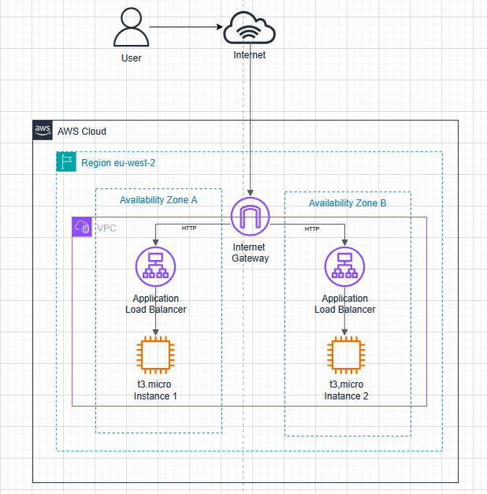

## Deployment Proof

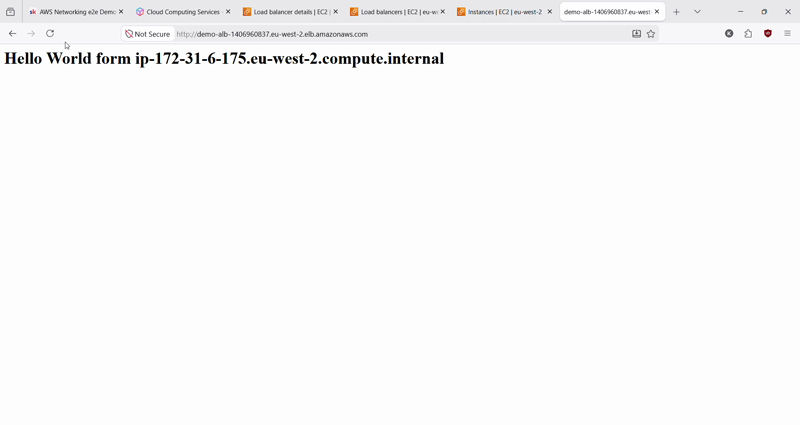

---

## Solution

### 1. Launching EC2 Instances

**1.1 Configuring EC2 Settings**

Once logged into the AWS console, navigate to Instances in the EC2 service and Click the **Launch Instances** button.

EC2 settings:
- `t3.micro` instance type.
- `Amazon Linux` AMI selected.
- Proceed with no key pairs selection (not required as no ssh access will be allowed)
- Enable auto assign IPv4 address
- `1 x 8 GiB Root volume, 3000 IOPS, Not encrypted` for storage.  

**1.2 Network Settings**

Make sure the two instances are launched in the same VPC. For ensuring higher availability, launch instances in different subnets associated to separate AZs.

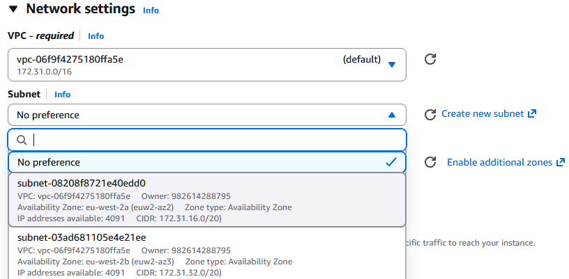

**1.3 Security Group**

Select the **Create New Security Group** option. Toggle ssh off and http on from any source. 

Later in this solution we will create a new security group that only allows traffic from the Application Load Balancer.

**1.4 User Data**

Navigate to the advanced settings section of the EC2 configuration. At the end of the advanced settings, there is an option for **User Data**. This is a script that runs with sudo privileges when the instances start-up.

Type the following:
```bash
yum update -y
yum install httpd

systemctl start httpd
systemctl enable httpd

echo "Hello World from $(hostname -f)" > /var/www/html/index.html
```
The script updates the package manager, then installs the Apache server module `httpd`. `systemctl start` deploys the server and  `systemctl enable` makes sure it automatically recovers if the instance reboots later. The last line is will print the html, the two instances will have different hostnames, which will allow for telling them apart.

**1.4 Connecting to Instances**

The instances can be accessed by HTTP through the internet. Navigate to the associated DNS provided by AWS.

Instance 1 screenshot:
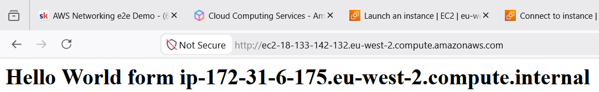

Instance 2 screenshot
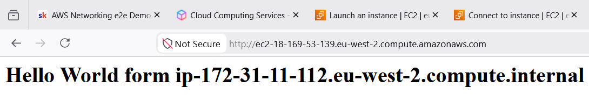

---

### 2. Application Load Balancer

**2.1 Creating ALB**

Navigate to the Load Balancer section of the EC2 service. Click **Create Load Balancer**, and select **Application Load Balancer**. ALB are picked for this scenario as they work in level 7 of the OSI model, meaning they can understand HTTP and make smart routing decisions based on traffic.

Select the same VPC the instances were launched on. ALB require a selection of at least two AZs, so select the same AZs the instances are in.

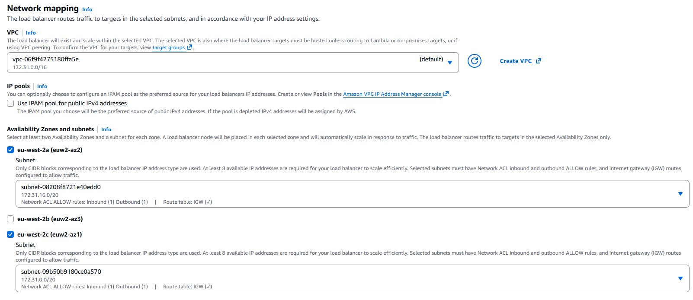

**2.2 Adding HTTP Listener and Target groups**

A listener is a process that checks for connection requests using the port and protocol configured. In this assignment we want this to be HTTP on port 80 as shown below.

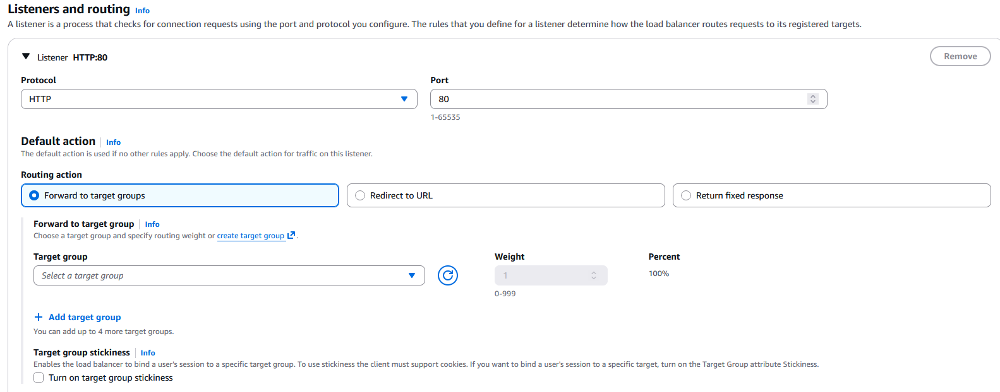

Now we need to create a target group, so that the ALB routes traffic towards a configured destination, in this case our instances. So select `Forward to target groups` for the **Routing action**, there aren't any target groups at this point - they need to be created.

In the same section there is a link that takes you to **Create target group** in a new tab. 

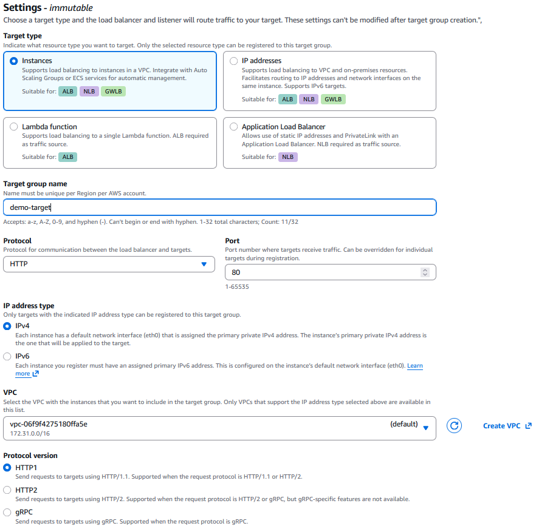

Target Group settings:
- `Instances` for target type.
- Add HTTP protocol on port 80 for communication between load balancer and targets,
- IPv4 address type.
- Select the VPC which is the same one that was used for the other components.
- Toggle `HTTP1`, the other protocol versions `HTTP2` AND `gPRC`, are advanced and not required in this assignment.
- The default security group is fine, we will change this in the next section.
- Make sure health check protocol is HTTP and the path is `/`   

Now we can move to registering the targets, which means adding the instances to the target group. Select the instances and click the **include as pending below button**.

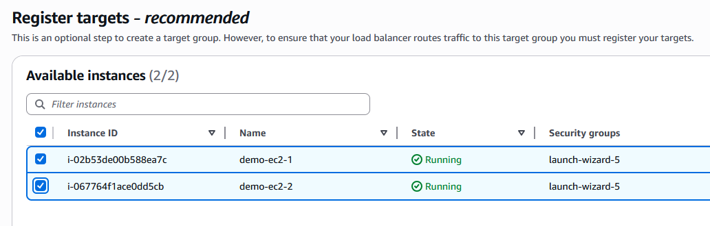

Now we can review and create the targets as shown in the image below.

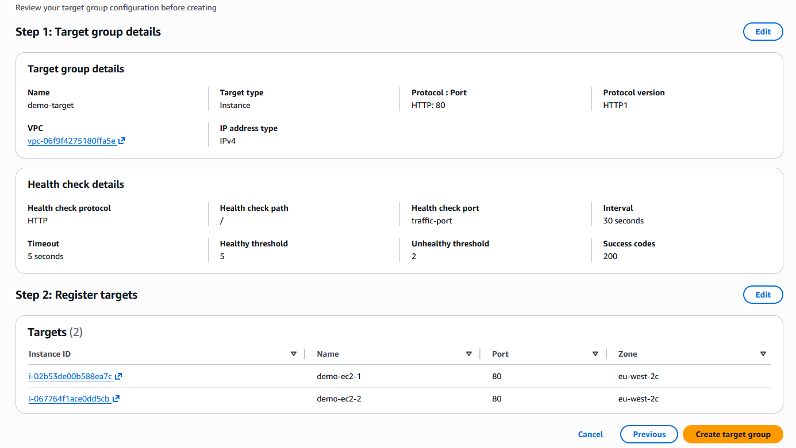

Back to configuring the ALB, the a target group now shows when the refresh button is clicked. Select the target group.

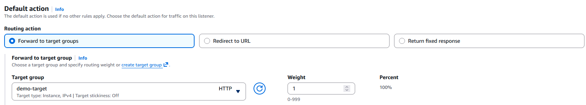

All settings for the ALB are set, click **Create load Balancer**.

---

### 3. Security Groups

The load balancer is created and forwards HTTP traffic to the instances, the only issue is that the instances can be accessed by anyone through the internet with the current security groups.

**3.1 ALB Security Group**

Navigate to the **Security Groups** section in the EC2 service and click **Create Security group**. Again, make sure the VPC selected is correct.

Add inbound rules that allows HTTP from anywhere. No other protocol should be allowed.

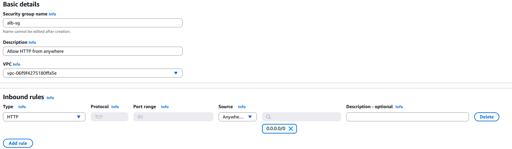

Once created, navigate to the ALB and edit the security group through the **Actions Tab**, and select the security group made for the ALB.

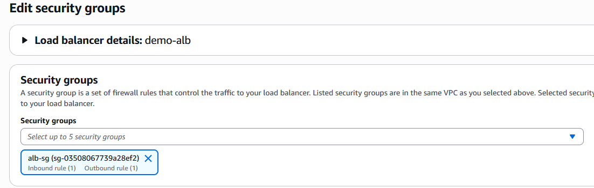

**3.2 EC2 Security Group**

Create another security group that will be attached to the EC2 instances. 

Add inbound rules of type HTTP and custom source of the ALB security group. This will make it so any HTTP traffic that comes from a resource attached to the ALB security group is trusted. There is no direct public access to the EC2 instances, only through the ALB

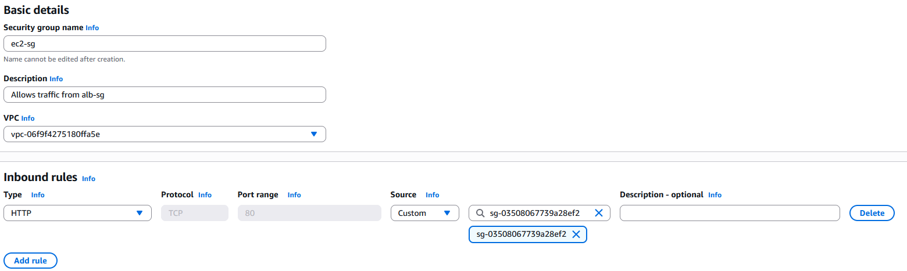

Once created, navigate to the instances and edit the security group through the **Actions Tab**, and select the security group we just made. Make sure the security group is changed for both instances


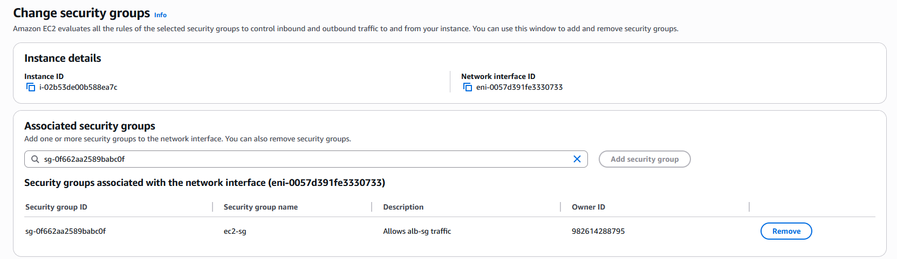

---

### 4. Testing

**4.1 Visiting ALB DNS**

Navigate to the ALB DNS provisioned by AWS. Refresh to verify traffic alternates between both instances.

**4.2 Health Check**

We can also navigate to our target group to find out if our instances are running well.

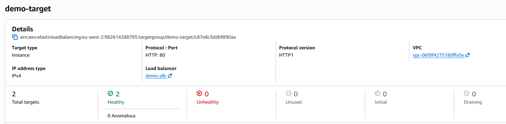

The assignment is complete.
